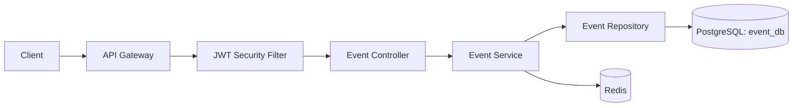
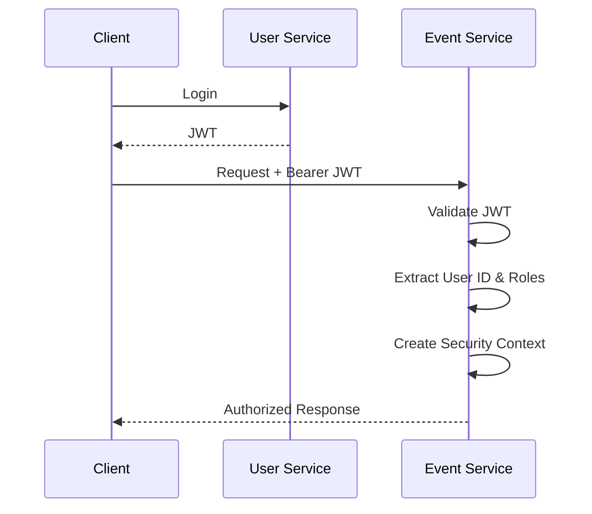
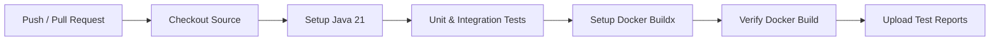

# Event Ticketing - Event Service

[](https://github.com/YOUR_GITHUB_USERNAME/event-ticketing-event-service/actions)

## 📌 Overview

`event-ticketing-event-service` is the microservice responsible for Event Management and event-related operations within the Event Ticketing System.

The service provides event creation, retrieval, update, cancellation, venue conflict validation, pagination, caching, and organizer-based authorization.

It is designed as an independently deployable Spring Boot microservice with PostgreSQL for persistent storage and Redis for caching.

---

## 🏗️ Service Responsibilities

- Event creation and management.
- Event details retrieval.
- Event scheduling and venue management.
- Venue conflict detection.
- Event status management.
- Organizer-based event management.
- Upcoming event listing with pagination.
- Event caching using Redis.
- JWT-based authentication.
- Role-based authorization.
- Request validation and centralized exception handling.

---

## 🛠️ Tech Stack & Configuration

| **Component** | **Technology / Detail** |
| --- | --- |
| **Language** | Java 21 |
| **Framework** | Spring Boot 4.1.1 |
| **Web** | Spring Web MVC |
| **Security** | Spring Security |
| **Authentication** | JWT |
| **Authorization** | Role-Based Access Control |
| **Validation** | Spring Validation |
| **Persistence** | Spring Data JPA / Hibernate |
| **Database** | PostgreSQL (`event_db`) |
| **Caching** | Spring Data Redis |
| **Testing** | JUnit 5, Mockito, MockMvc |
| **Integration Testing DB** | H2 |
| **Build Tool** | Maven |
| **Containerization** | Docker |
| **CI** | GitHub Actions |
| **Boilerplate Reduction** | Lombok |

---

## 📐 Service Architecture



The service follows a layered architecture:

```text
Client
   ↓
API Gateway
   ↓
JWT Security Filter
   ↓
Controller
   ↓
Service
   ↓
Repository
   ↓
PostgreSQL
```

Redis is used alongside the service layer to cache frequently requested event data.

---

## 📦 Event Domain Model

The Event Service manages event information including:

| **Field** | **Description** |
| --- | --- |
| `id` | Unique event identifier (UUID) |
| `title` | Event title |
| `description` | Event description |
| `venue` | Event venue |
| `eventDateTime` | Event starting date and time |
| `endDateTime` | Calculated event ending date and time |
| `totalTickets` | Total ticket capacity |
| `availableTickets` | Currently available ticket count |
| `ticketPrice` | Ticket price |
| `organizerId` | Organizer who owns the event |
| `status` | Current event status |
| `version` | Optimistic locking version |
| `createdAt` | Event creation timestamp |
| `updatedAt` | Last update timestamp |

### Event Status

Supported event states include:

```text
PUBLISHED
CANCELLED
COMPLETED
```

---

## 🚀 Event Operations

### Create Event

An organizer can create a new event by providing:

- Title
- Description
- Venue
- Event date and time
- Duration
- Total number of tickets
- Ticket price

The service automatically:

- Calculates the event end time.
- Initializes available tickets.
- Associates the authenticated organizer with the event.
- Checks for venue conflicts.
- Persists the event.
- Invalidates the relevant event-list cache.

### Retrieve Event

The service supports:

- Retrieving a single event by ID.
- Retrieving upcoming events.
- Paginated event retrieval.

### Update Event

Only the organizer who owns the event can update it.

The service:

- Validates event ownership.
- Prevents modification of cancelled or completed events.
- Recalculates the event end time.
- Checks for venue conflicts while excluding the current event.
- Invalidates affected cache entries.

### Cancel Event

Events use logical cancellation instead of physical deletion.

When an organizer cancels an event:

```text
PUBLISHED → CANCELLED
```

The event remains in the database while its status changes to `CANCELLED`.

Cancelled or completed events cannot be cancelled again.

---

## 🏢 Venue Conflict Detection

The Event Service prevents multiple active events from occupying the same venue during overlapping time periods.

Two events overlap when:

```text
existingStart < requestedEnd
AND
existingEnd > requestedStart
```

The service also applies a scheduling buffer around event times when checking venue availability.

Cancelled events are excluded from venue conflict detection.

During an update operation, the current event is excluded from the conflict query.

---

## 🔐 Security

The Event Service uses stateless JWT-based security.

Authentication is performed by the User Service, which issues a JWT after successful login.

The Event Service independently validates the received JWT and extracts:

- User ID
- User roles

The authenticated user information is then stored in the Spring Security context for authorization.

### Authentication Flow



The Event Service does not maintain server-side authentication sessions.

---

## 🛡️ Role-Based Authorization

Event management operations are restricted based on user roles.

| **Operation** | **Access** |
| --- | --- |
| View event | Public |
| View upcoming events | Public |
| Create event | `ORGANIZER` |
| Update event | `ORGANIZER` |
| Cancel event | `ORGANIZER` |

Spring Security authorities use the format:

```text
ROLE_ORGANIZER
```

In addition to role-based authorization, update and cancellation operations verify that the authenticated organizer owns the target event.

---

## ⚡ Redis Caching

Redis is used to reduce unnecessary database queries for frequently requested event data.

### Cached Data

Individual event:

```text
event
```

Upcoming event lists:

```text
event_list
```

### Cache Strategy

Read operations may retrieve data from Redis before querying PostgreSQL.

Event modification operations invalidate affected cache entries.

```text
GET Event
   ↓
Redis Cache
   ↓ Cache Miss
PostgreSQL
```

Create, update, and cancellation operations invalidate event-list caches to prevent stale event information.

---

## 🗄️ Database

The Event Service uses PostgreSQL as its primary persistent database.

Default database:

```text
event_db
```

Spring Data JPA and Hibernate are used for persistence.

The repository layer provides:

- Standard CRUD operations.
- Upcoming event queries.
- Venue conflict detection.
- Venue conflict detection excluding the currently updated event.
- Pagination support.

---

## 🔄 Optimistic Locking

The Event entity uses JPA optimistic locking through:

```java
@Version
private Long version;
```

This helps protect an event from lost updates when multiple transactions attempt to modify the same event concurrently.

---

## ✅ Request Validation

Incoming requests are validated using Jakarta Bean Validation.

Examples include:

- Event title must not be blank.
- Venue must not be blank.
- Event date must be in the future.
- Total tickets must be at least `1`.
- Ticket price cannot be negative.
- Event duration must be between `1` and `24` hours.

Invalid requests return an appropriate client error response.

---

## ⚠️ Exception Handling

The service uses centralized exception handling for application-level errors.

Examples include:

- Resource not found.
- Venue conflict.
- Unauthorized event access.
- Invalid event state.
- Request validation errors.

This keeps controllers clean while providing consistent HTTP error responses.

---

## 🧪 Testing Strategy

The Event Service contains multiple testing layers.

```text
Testing
├── Unit Tests
├── Controller Tests
└── Integration Tests
```

### Unit Tests

Service-layer unit tests use:

- JUnit 5
- Mockito

Dependencies such as repositories and mappers are mocked so that business logic can be tested independently.

Business scenarios include:

- Event creation.
- Venue conflict detection.
- Event retrieval.
- Pagination.
- Event update.
- Organizer ownership validation.
- Invalid event states.
- Event cancellation.

### Controller Tests

Controller tests use Spring `MockMvc` to validate the HTTP layer.

They verify:

- Request mapping.
- Request body processing.
- Validation.
- HTTP status codes.
- JSON response structures.

### Integration Tests

Integration tests validate the interaction between multiple application layers.

Current integration test structure:

```text
src/test/java/com/eventticketing/eventservice/integration/
├── AbstractEventIntegrationTest.java
├── CreateEventIntegrationTest.java
├── GetEventIntegrationTest.java
├── UpdateEventIntegrationTest.java
└── CancelEventIntegrationTest.java
```

Integration tests cover:

- Event creation and database persistence.
- Venue conflict handling.
- Invalid event creation requests.
- Event retrieval.
- Event-not-found scenarios.
- Upcoming event pagination.
- Event updates.
- Organizer ownership validation.
- Event cancellation.
- Invalid event state handling.

---

## 🧪 Test Environment

Integration tests use a dedicated Spring test profile.

```text
application-test.yml
```

H2 is used as the integration testing database so that tests do not depend on the local PostgreSQL development database.

Example configuration:

```yaml
spring:
  datasource:
    url: jdbc:h2:mem:test_db;DB_CLOSE_DELAY=-1;DB_CLOSE_ON_EXIT=FALSE;MODE=PostgreSQL
    username: sa
    password:
    driver-class-name: org.h2.Driver

  jpa:
    database-platform: org.hibernate.dialect.H2Dialect
    hibernate:
      ddl-auto: create-drop

  cache:
    type: none
```

A test-only JWT secret is configured for the test environment.

Production secrets must never be committed to the repository.

---

## ▶️ Running Tests

Run all tests:

```bash
./mvnw clean test
```

Run a specific integration test:

```bash
./mvnw -Dtest=CreateEventIntegrationTest test
```

```bash
./mvnw -Dtest=GetEventIntegrationTest test
```

```bash
./mvnw -Dtest=UpdateEventIntegrationTest test
```

```bash
./mvnw -Dtest=CancelEventIntegrationTest test
```

---

## 🐳 Docker

The Event Service is containerized using Docker.

Build the application:

```bash
./mvnw clean package
```

Build the Docker image:

```bash
docker build -t event-ticketing-event-service .
```

Run the container:

```bash
docker run event-ticketing-event-service
```

Runtime configuration such as database credentials, Redis configuration, and JWT secrets should be provided through environment variables rather than hard-coded into the image.

---

## 🔄 CI Pipeline

GitHub Actions is used for Continuous Integration.

The CI workflow is triggered when:

```text
Pull Request → develop
Pull Request → main
Push → develop
```

### CI Workflow



The pipeline performs:

1. Source code checkout.
2. JDK 21 setup.
3. Maven dependency caching.
4. Unit and integration test execution.
5. Docker Buildx setup.
6. Docker image build verification.
7. Test report artifact upload.

The CI pipeline does not push the Docker image during validation builds.

---

## 📊 Test Reports

GitHub Actions uploads Maven Surefire test reports after CI execution.

Reports are generated under:

```text
target/surefire-reports/
```

The reports are retained as GitHub Actions artifacts for debugging failed CI runs.

---

## 🔧 Maven Wrapper

The repository includes the Maven Wrapper:

```text
.mvn/
mvnw
mvnw.cmd
```

Therefore, contributors and CI environments can build the project without requiring a separately installed Maven version.

Linux/macOS:

```bash
./mvnw clean test
```

Windows:

```powershell
mvnw.cmd clean test
```

---

## 📁 Project Structure

```text
event-ticketing-event-service/
├── .github/
│   └── workflows/
│       └── ci.yml
├── .mvn/
│   └── wrapper/
│       └── maven-wrapper.properties
├── src/
│   ├── main/
│   │   ├── java/
│   │   │   └── com/eventticketing/eventservice/
│   │   │       ├── adviser/
│   │   │       ├── configuration/
│   │   │       ├── controller/
│   │   │       ├── dto/
│   │   │       ├── entity/
│   │   │       ├── enums/
│   │   │       ├── exception/
│   │   │       ├── repository/
│   │   │       ├── security/
│   │   │       ├── service/
│   │   │       └── EventServiceApplication.java
│   │   └── resources/
│   └── test/
│       ├── java/
│       │   └── com/eventticketing/eventservice/
│       │       └── integration/
│       └── resources/
│           └── application-test.yml
├── Dockerfile
├── .gitignore
├── .env.example
├── mvnw
├── mvnw.cmd
├── pom.xml
└── README.md
```

---

## 🔑 Environment Configuration

Sensitive configuration should be supplied through environment variables.

Typical runtime configuration includes:

```text
Database URL
Database username
Database password
Redis host
Redis port
JWT secret
```

Real credentials and secrets must not be committed to Git.

An `.env.example` file can be maintained to document the required environment variables without exposing sensitive values.

---

## 🔮 Future Improvements

Planned improvements for the Event Service and deployment lifecycle include:

- Docker image publishing to Amazon ECR.
- Kubernetes deployment.
- Amazon EKS deployment.
- Managed PostgreSQL using Amazon RDS.
- Managed Redis using Amazon ElastiCache.
- Infrastructure provisioning with Terraform.
- CD pipeline implementation.
- Prometheus metrics collection.
- Grafana dashboards.
- Centralized logging with Loki.

---

## 📄 License

This project is developed as part of the Event Ticketing System.