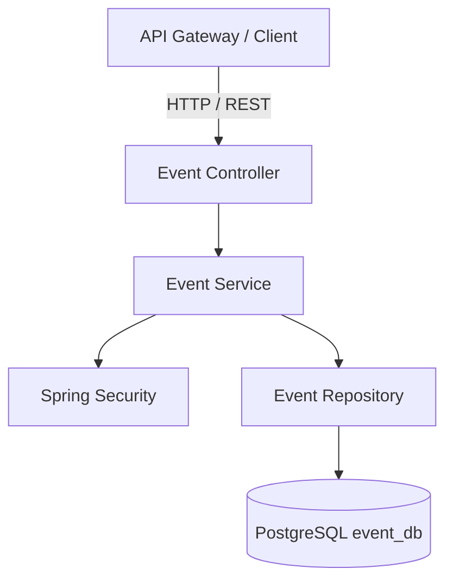

# Event Ticketing - Event Service

## 📌 Overview

`event-ticketing-event-service` is the core microservice responsible for managing the Event Management context of the Event Ticketing System.

## 🏗️ Service Responsibilities

* Event creation and management.
* Event details, scheduling, and venue management.
* Event status and availability management.
* Organizer-based event management.

## 🛠️ Tech Stack

* **Language:** Java 21
* **Framework:** Spring Boot 3.x
* **Security:** Spring Security
* **Database:** PostgreSQL (`event_db`)
* **Containerization:** Docker

## 📐 Architecture

